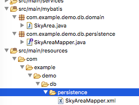

#Configure Mybatis Projects With Spring-Boot


- Create the default Spring-boot-starter project

- Install the [Mybatipse Plugin](https://github.com/mybatis/mybatipse) in STS 


- Create the source folder for mybatis and service.

````   
	 src/main/mybatis
	 src/main/servies
````
- Add the plugin for multiple diretories in pom.xml

```
	<!-- Multiple Source Directories Plugin -->

	<plugin>
		<groupId>org.codehaus.mojo</groupId>
		<artifactId>build-helper-maven-plugin</artifactId>
		<version>1.9.1</version>
		<executions>
			<execution>
				<id>add-source</id>
				<phase>generate-sources</phase>
				<goals>
					<goal>add-source</goal>
				</goals>
			<configuration>
				<sources>
				  <source>${basedir}/src/main/java</source>
				  <source>${basedir}/src/main/mybatis</source>
				  <source>${basedir}/src/main/services</source>
	<!-- Add more source directories here . -->
							</sources>
			</configuration>
			</execution>
					
		  </executions>
	</plugin>
		
```

- create the mybatis-generator plugin in pom.xml

```
	<!-- Table to Domain / Mapper Plugin -->
		<plugin>
				<groupId>org.mybatis.generator</groupId>
				<artifactId>mybatis-generator-maven-plugin</artifactId>
				<version>1.3.0</version>
				<goals>
					<goal>mybatis-generator:generate</goal>

				</goals>

				<configuration>
					<verbose>true</verbose>
					<overwrite>true</overwrite>
				</configuration>
				<dependencies>
					<dependency>
						<groupId>mysql</groupId>
						<artifactId>mysql-connector-java</artifactId>
						<version>5.1.31</version>
					</dependency>
					<dependency>
						<groupId>org.mybatis.generator</groupId>
						<artifactId>mybatis-generator-core</artifactId>
						<version>1.3.2</version>
					</dependency>

				</dependencies>
			</plugin>
		
		
```

- create generatorConfig.xml in the src/main/resources

```
<?xml version="1.0" encoding="UTF-8"?>
<!DOCTYPE generatorConfiguration
  PUBLIC "-//mybatis.org//DTD MyBatis Generator Configuration 1.0//EN"
  "http://mybatis.org/dtd/mybatis-generator-config_1_0.dtd">

	<generatorConfiguration>
    

    <context id="MySQL" targetRuntime="MyBatis3">

        <commentGenerator>
            <property name="suppressDate" value="true" />
        </commentGenerator>

        <jdbcConnection driverClass="com.mysql.jdbc.Driver"
            connectionURL="jdbc:mysql://127.0.0.1:3306/sky_game" userId="root" password="youpassword">
        </jdbcConnection>

        <javaTypeResolver>
            <property name="forceBigDecimals" value="false" />
        </javaTypeResolver>

        <javaModelGenerator targetPackage="com.example.demo.db.domain"
            targetProject="src/main/mybatis">
            <property name="enableSubPackages" value="true" />
            <property name="trimStrings" value="true" />
        </javaModelGenerator>

        <sqlMapGenerator targetPackage="com.example.demo.db.persistence"
            targetProject="src/main/resources">
            <property name="enableSubPackages" value="true" />
        </sqlMapGenerator>
	 	<!-- ANNOTATEDMAPPER  /XMLMAPPER   -->
        <javaClientGenerator type="XMLMAPPER"
            targetPackage="com.example.demo.db.persistence" targetProject="src/main/mybatis">
            <property name="enableSubPackages" value="true" />
        </javaClientGenerator>  
        
        
      <table tableName="sky_area" domainObjectName="SkyArea" 
        enableCountByExample="false"
        enableDeleteByExample="false"
        enableDeleteByPrimaryKey="false"
        enableSelectByExample="false"
        enableSelectByPrimaryKey="true"
        enableUpdateByExample="false"
        enableUpdateByPrimaryKey="true">
        </table>

        
    
    </context>
</generatorConfiguration>
```

**MUST ATTENTION**:

*Every time run the generatorConfig.xml ,the table will create new domain ,mapper interface,xml file and replace the exists!!!!!*

- generate the domain,mapper and xml.

	
		
	

	```
		mvn mybatis-generator:generate
	```
	
	
	
- spring-mybatis configure 

` src/resources/META-INF/spring/applicationContext-jdbc.xml`


```

<?xml version="1.0" encoding="UTF-8"?>
<beans xmlns="http://www.springframework.org/schema/beans"
	xmlns:xsi="http://www.w3.org/2001/XMLSchema-instance"
	xmlns:context="http://www.springframework.org/schema/context"
	xsi:schemaLocation="http://www.springframework.org/schema/beans http://www.springframework.org/schema/beans/spring-beans-4.3.xsd
		http://www.springframework.org/schema/context http://www.springframework.org/schema/context/spring-context-4.3.xsd">

	
	<context:property-placeholder location="classpath*:META-INF/spring/*.properties" />
	<!-- Turn on AspectJ @Configurable support. As a result, any time you instantiate 
		an object, Spring will attempt to perform dependency injection on that object. 
		This occurs for instantiation via the "new" keyword, as well as via reflection. 
		This is possible because AspectJ is used to "weave" Roo-based applications 
		at compile time. In effect this feature allows dependency injection of any 
		object at all in your system, which is a very useful feature (without @Configurable 
		you'd only be able to dependency inject objects acquired from Spring or subsequently 
		presented to a specific Spring dependency injection method). Roo applications 
		use this useful feature in a number of areas, such as @PersistenceContext 
		injection into entities. -->
	<context:spring-configured />
	<!-- This declaration will cause Spring to locate every @Component, @Repository 
		and @Service in your application. In practical terms this allows you to write 
		a POJO and then simply annotate the new POJO as an @Service and Spring will 
		automatically detect, instantiate and dependency inject your service at startup 
		time. Importantly, you can then also have your new service injected into 
		any other class that requires it simply by declaring a field for your service 
		inside the relying class and Spring will inject it. Note that two exclude 
		filters are declared. The first ensures that Spring doesn't spend time introspecting 
		Roo-specific ITD aspects. The second ensures Roo doesn't instantiate your 
		@Controller classes, as these should be instantiated by a web tier application 
		context. Refer to web.xml for more details about the web tier application 
		context setup services. Furthermore, this turns on @Autowired, @PostConstruct 
		etc support. These annotations allow you to use common Spring and Java Enterprise 
		Edition annotations in your classes without needing to do any special configuration. 
		The most commonly used annotation is @Autowired, which instructs Spring to 
		dependency inject an object into your class. -->
	
	
	<bean class="org.apache.commons.dbcp.BasicDataSource"
		destroy-method="close" id="dataSource">
		<property name="driverClassName" value="${database.driverClassName}" />
		<property name="url" value="${database.url}" />
		<property name="username" value="${database.username}" />
		<property name="password" value="${database.password}" />
		<property name="testOnBorrow" value="true" />
		<property name="testOnReturn" value="true" />
		<property name="testWhileIdle" value="true" />
		<property name="timeBetweenEvictionRunsMillis" value="1800000" />
		<property name="numTestsPerEvictionRun" value="3" />
		<property name="minEvictableIdleTimeMillis" value="1800000" />
		<property name="validationQuery" value="SELECT 1" />
	</bean>
	
	<!-- transaction manager, use JtaTransactionManager for global tx -->
    <bean id="transactionManager" class="org.springframework.jdbc.datasource.DataSourceTransactionManager">
        <property name="dataSource" ref="dataSource" />
    </bean>

	

    <!-- define the SqlSessionFactory -->
    <bean id="sqlSessionFactory" class="org.mybatis.spring.SqlSessionFactoryBean">
        <property name="dataSource" ref="dataSource" />
        <property name="typeAliasesPackage" value="com.example.demo.db.domain" />
        <!--  <property name="typeAliasesPackage" value="com.example.demo.db.domain,com.exmple.xx" /> -->
     	<property name="mapperLocations">
			<list>
				<value>classpath*:com/example/demo/db/**/*.xml</value>
				
			</list>
		</property>
     </bean>

    <!-- scan for mappers and let them be autowired -->
    <bean class="org.mybatis.spring.mapper.MapperScannerConfigurer">
        <property name="basePackage" value="com.example.demo.db.persistence" />
    </bean>


</beans>
```

` src/resources/META-INF/spring/debug.properties`


```
#Updated at Sun Nov 20 09:46:37 EST 2011
#Sun Nov 20 09:46:37 EST 2011
database.password=youpassword
database.url=jdbc:mysql://127.0.0.1:3306/sky_game?autoReconnect=true
database.username=root
database.driverClassName=com.mysql.jdbc.Driver
```

- add the import resource in main application

`@ImportResource("classpath*:META-INF/spring/applicationContext-jdbc.xml")`

- add aspectj plugin (jta annotation transactional configure by mybatis) in pom.xml

```
	<!-- JTA Aspect Used -->
		<dependency>
   			 <groupId>org.springframework</groupId>
    			<artifactId>spring-aspects</artifactId>
   		</dependency>
	<dependency>
			<groupId>org.springframework</groupId>
			<artifactId>spring-aop</artifactId>
		</dependency>
		<dependency>
			<groupId>org.aspectj</groupId>
			<artifactId>aspectjweaver</artifactId>
			<version>${aspectj.version}</version>
		</dependency>
		
```

```
<plugin>
				<groupId>org.springframework.boot</groupId>
				<artifactId>spring-boot-maven-plugin</artifactId>
				<dependencies>
						
						<dependency>
							<groupId>org.aspectj</groupId>
							<artifactId>aspectjweaver</artifactId>
							<version>${aspectj.version}</version>
						</dependency>
					</dependencies>
			</plugin>
			<!-- AspectJ Compiled Plugin -->
			<plugin>
				<groupId>org.codehaus.mojo</groupId>
				<artifactId>aspectj-maven-plugin</artifactId>
				<version>1.10</version>
				<configuration>
					<source>${java.version}</source>
					<target>${java.version}</target>
					<proc>none</proc>
					<complianceLevel>${java.version}</complianceLevel>
					<showWeaveInfo>true</showWeaveInfo>
				</configuration>
				<executions>
					<execution>
						<goals>
							<goal>compile</goal>
						</goals>
					</execution>
				</executions>
				<dependencies>
					<dependency>
						<groupId>org.aspectj</groupId>
						<artifactId>aspectjtools</artifactId>
						<version>${aspectj.version}</version>
					</dependency>
				</dependencies>
			</plugin>
			
			

```


- create simple rest api

- create simple service interface IAreaService
- create simple default service implementation DefaultAreaService


 


